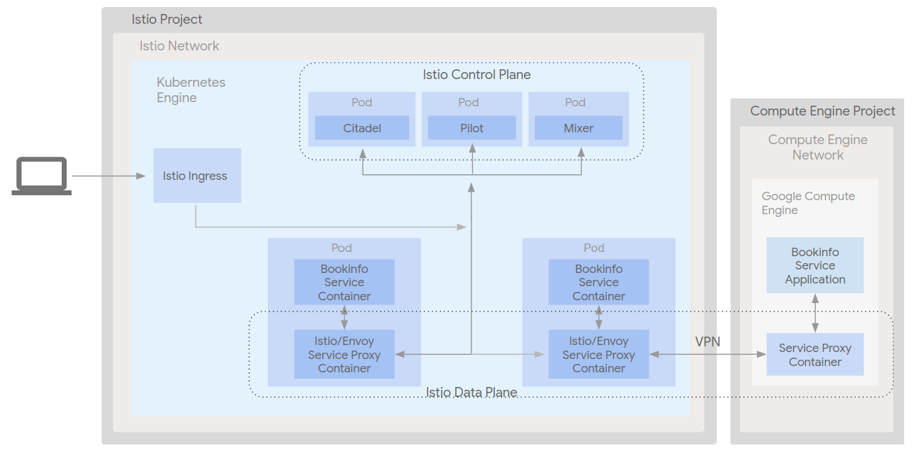
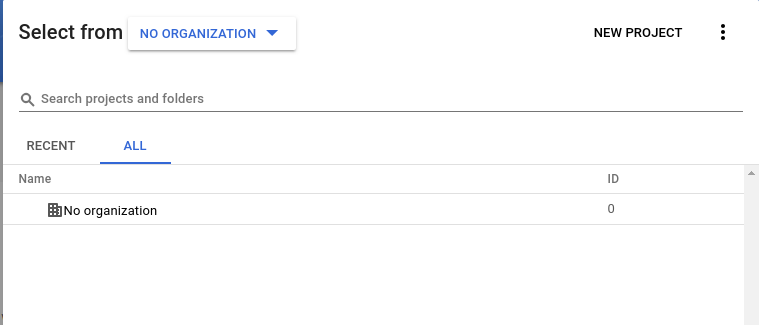
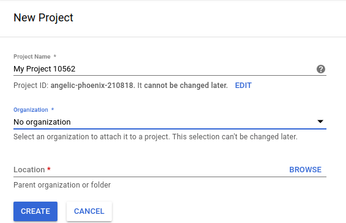

# Istio on Kubernetes Engine and Compute Engine

* [Introduction](#introduction)
* [Architecture](#architecture)
  * [Application architecture](#application-architecture)
  * [Infrastructure architecture](#infrastructure-architecture)
* [Prerequisites](#prerequisites)
  * [Tools](#tools)
* [Creating a project](#creating-a-project)
* [Deployment](#deployment)
  * [Noteworthy Aspects of the Deployment:](#noteworthy-aspects-of-the-deployment)
* [Validation](#validation)
* [Tear Down](#tear-down)
* [Known issues](#known-issues)
* [Troubleshooting](#troubleshooting)
* [Relevant Material](#relevant-material)

## Introduction

Istio is part of a new category of products known as "service mesh" software
designed to manage the complexity of service resilience in a microservice
infrastructure; it defines itself as a service management framework built to
keep business logic separate from the logic to keep your services up and
running. In other words, it provides a layer on top of the network that will
automatically route traffic to the appropriate services, handle [circuit
breaker](https://en.wikipedia.org/wiki/Circuit_breaker_design_pattern) logic,
enforce access and load balancing policies, and generate telemetry data to
gain insight into the network and allow for quick diagnosis of issues.

For more information on Istio, please refer to the [Istio
documentation](https://istio.io/docs/).

This repository contains demonstration code for Istio's mesh expansion feature
between resources in two Google Cloud Platform (GCP) projects connected via
VPN. The feature allows for a non-Kubernetes service running outside of the
Istio infrastructure on Kubernetes Engine to be integrated into and managed by
the Istio service mesh.

## Architecture

This demonstration will create a number of resources.

* A single (GKE) cluster with IP aliasing turned on in a custom network in
  project A
* A Google Compute Engine (GCE) instance in a custom network project B
* A VPN bridging the two networks containing the GKE cluster and the GCE
  instance
* The Istio service mesh installed in the GKE cluster
* The BookInfo application installed in the Istio service mesh
* A firewall rule allowing full SSH access to the GCE instance from any IP
  address
* A firewall rule allowing full access to the MySQL database from the GKE
  cluster

#### Application architecture


#### Infrastructure architecture



## Prerequisites

### Tools

In order to use the code in this demo you will need to have have access to a
bash-compatible shell with the following tools installed:

* Two [GCP projects](https://console.cloud.google.com/) with billing enabled
* [Google Cloud SDK (200.0.0 or later)](https://cloud.google.com/sdk/downloads)
* [HashiCorp Terraform v0.11.7](https://www.terraform.io/downloads.html)
* [kubectl (v1.10.0 or later)](https://kubernetes.io/docs/tasks/tools/install-kubectl/)

## Creating a project
In order to complete this demo, two proejcts need to exist, one for the GKE
cluster and a second for the GCE instance, which will be connected via a VPN.

To create projects:
1. Log in to the GCP Console
1. click on "Select a project" in the top navigating bar
1. Click on "New Project" in on the top right of the window



1. Select a project name, and note the project id below it.
(in this case, the project id is 'angelic-phoenix-210818')



1. Enable billing by clicking on the three lines in the top left corner
select "Billing" and enable it


## Deployment

Clone the repository and change directory to the `gke-istio-vpn-demo`
directory.

The `gke-istio-vpn-demo` folder is considered the working directory and
all commands should be executed from it.

Open the `istio.env` file and set
  * `ISTIO_PROJECT` to the ID of the project you want to use for Istio
    infrastructure
  * `GCE_PROJECT` to the ID of the project you want to use for GCE
  * The ID of the project is not always the same as the name.
  * Any variables you wish to customize

When you are done, save the file and run the `install.sh` script. You will be
prompted if you want to deploy the infrastructure by Terraform. When you reach
this point, go ahead and type `yes`.
```
Do you want to perform these actions?
  Terraform will perform the actions described above.
  Only 'yes' will be accepted to approve.

  Enter a value: yes
```

This script
will deploy all of the necessary infrastructure to correctly run Istio.

### Noteworthy Aspects of the Deployment:
1. The GKE cluster uses IP aliasing, without this feature, the demo would not
work. IP Aliasing is a feature by which services and pods can have their IP
addresses set to values within a specific CIDR block, which allows them to be
known in advance of a deployment, and callable by other resources. This also
ensures that the IP addresses will not conflict with other GCP resources and
provides an additional mechanism for firewall traffic control (eg rules on the
pod may differ from those on the underlying host).
For more information on IP Aliasing see:
https://cloud.google.com/kubernetes-engine/docs/how-to/alias-ips

1. The GKE cluster's IP CIDR blocks are defined in the istio.env file and can
be changed in the event that other values are needed (eg if they conflict with
other IP address space).

1. Firewall and Routing rules are created at deployment time to facilitate the
necessary communication without exposing ports and services unnecessarily.

1. The VPN configuration (endpoints, firewalls and routing rules) are defined in
the included terraform configuration (./main.tf). For more information on VPN's
see: https://cloud.google.com/vpn/docs/how-to

## Validation

To validate that everything is working correctly, first open your browser to
the URL provided at the end of the installation script.
You'll see a BookInfo web site. After taking a look, run:

```
./validate.sh <STARS>
```

where <STARS> is the number of stars to be returned as the rating given by the
first review on the product page.

You'll see output similar to

```
114c114
<                   <!-- empty stars: -->
---
>                     <span class="glyphicon glyphicon-star"></span>
116c116
<                     <span class="glyphicon glyphicon-star-empty"></span>
---
>                     <span class="glyphicon glyphicon-star"></span>
118c118
<                     <span class="glyphicon glyphicon-star-empty"></span>
---
>                     <span class="glyphicon glyphicon-star"></span>
120c120
<                     <span class="glyphicon glyphicon-star-empty"></span>
---
>                     <span class="glyphicon glyphicon-star"></span>
122c122
<                     <span class="glyphicon glyphicon-star-empty"></span>
---
>                   <!-- empty stars: -->
```

Refresh the page in your browser, the first rating should reflect the
number of stars passed to the validate script. Behind the scenes, the validate
script is directly editing the database on the GCE VM that was integrated into
the mesh, proving that the BookInfo application is using the database on the VM
as the source of the rating data.

## Tear Down

To tear down the resources created by this demo, run

```
./tear-down.sh
```

You should be prompted by terraform about whether or not you want to tear down
the infrastructure. It will look similar to

```
...
  - google_compute_subnetwork.subnet_istio

  - google_compute_vpn_gateway.target_gateway_gce

  - google_compute_vpn_gateway.target_gateway_istio

  - google_compute_vpn_tunnel.tunnel1_gce

  - google_compute_vpn_tunnel.tunnel1_istio

  - google_container_cluster.istio_cluster


Plan: 0 to add, 0 to change, 24 to destroy.

Do you really want to destroy?
  Terraform will destroy all your managed infrastructure, as shown above.
  There is no undo. Only 'yes' will be accepted to confirm.

  Enter a value:
```

Type `yes` to finish tearing down the infrastructure.

## Known issues

* The Istio Mesh Expansion feature does not support mutual TLS authentication

## Troubleshooting

**Problem:** The Book Reviews section is returning an error stating that the
ratings service is not available.

**Solution:** Istio may still be configuring the mesh. Wait for a minute so
while refreshing the page.

**Problem:** The install script fails with a `Permission denied` when running
Terraform.

**Solution:** The credentials that Terraform is using do not provide the
necessary permissions to create resources in the selected projects. Ensure
that the account listed in `gcloud config list` has necessary permissions to
create resources. If it does, regenerate the application default credentials
using `gcloud auth application-default login`.

**Problem:** Loss of GKE cluster network connectivity after 24 hours

**Solution:** Remove the GCE instance and rerun all steps involving the GCE
setup

**Problem:** The install script times out while waiting for the internal load
balancers to finish provisioning.

**Solution:** Likely the cause is a transient platform issue. Rerun the script
as it is idempotent up to this point process and should not run into any issues
with infrastructure that already exists.

**Problem:** The install script gives an error like:ERROR: (gcloud.services.enable) User [{your-email address}] does not have permission to access service [compute.googleapis.com:enable] (or it may not exist): Project '{your-project-name}' not found or permission denied.

**Solution:** Enter the project Id and not the project name into propeties.env

## Relevant Material

* https://github.com/istio/community
* https://istio.io/docs/guides/bookinfo.html
* https://cloud.google.com/kubernetes-engine/docs/tutorials/istio-on-gke
* https://cloud.google.com/compute/docs/tutorials/istio-on-compute-engine
* https://istio.io/docs/setup/kubernetes/mesh-expansion.html
* https://istio.io/docs/guides/integrating-vms.html
